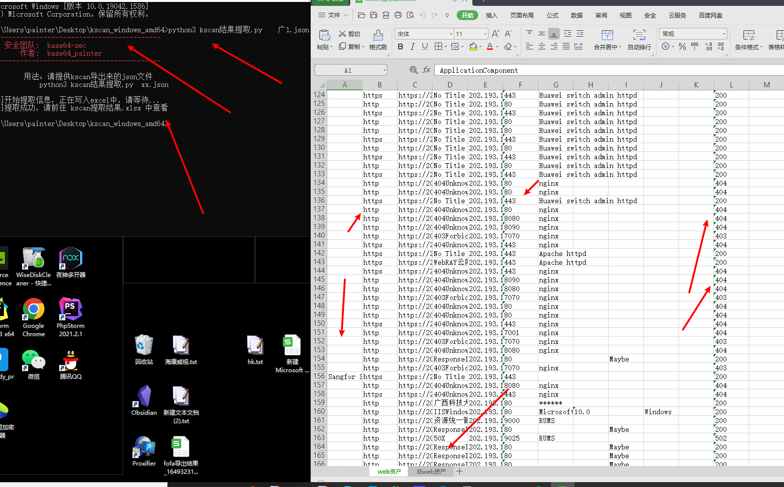

### 1、目的

kscan导出来的结果比较杂乱，所以就写了该工具对kscan导出来的json结果文件的信息进行提取

### 2、基本思路

对json的各个信息进行提取，同时对信息进行了分类，分为了web类和非web类，分类的目的就是方便后续的渗透测试思路，web类的可以尝试丢扫描器或者手工，非web类的可以尝试各种弱口令爆破，通过两步走来扩大战果

### 3、应用场景

通过分类得到的信息

- 对识别出指纹的，找历史漏洞进行打
- 对web类的资产直接丢扫描器进行批量扫描，比如nuclei、xray、goby
- 对web类资产的网站标题进行观察，通过观察标题，寻找漏洞可能性比较大的目标进行手工渗透测试
- 对非web的资产，直接丢hydra进行批量爆破即可

### 4、成品截图

### 5、工具下载地址

[lishang520/security-tools: 安全技术博客 (github.com)](https://github.com/lishang520/security-tools)